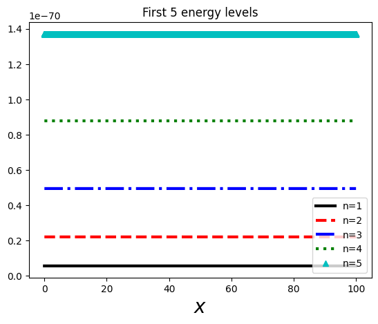
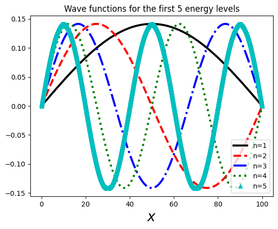

Lately I have had some extra quiet time due to medical conditions, and I took on some quantum mechanics. I followed the [MIT 8.04](https://ocw.mit.edu/courses/8-04-quantum-physics-i-spring-2013) course on OCW, but I'm also following the great ['Introduction to Quantum Mechanics' book by David Griffiths and Darrell Schroeter](https://doi.org/10.1017/9781316995433).

That made me rediscover my local library, and also too ['Numerical Methods in Physycs with Python' by Alex Gerzerlis](https://doi.org/10.1017/9781108772310) and that combination gives this series of articles on both, python and physics with some summaries, exercises and musings on the subject.

This is not meant to be a complete, or even incomplete introduction to quantum mechanics, it's just a set of exercises and notes for myself, though you might find helpful also if you are following a quantum mechanics course either on-site, online, or just reading a book.

## Single particle inside an infinite square potential well (1 Dimension)

We have a potential of the type:

$$
V(x) =
\begin{cases}
    0, & \text{if}\ 0 \le x \le L, \\\\
    \infty, & \text{otherwise} \\
\end{cases}
$$

Outside the well, it's clear that the particle can't exist, as the potential is infinite, so we can say that:

$$\psi(x) = 0$$

### Inside the well

Inside the well, we have $$V=0$$, so the time independent Schrödinger equation is:

$$
-\frac{\hbar}{2m}\frac{d^2\psi}{dx^2} = E\psi
$$

This can be rewritten as a simple harmonic oscillator:

$$
\frac{d^2\psi}{dx^2}=k^2\psi, \hspace{1cm} \text{where} \hspace{0.5cm} k \equiv \frac{\sqrt{2mE}}{\hbar}
$$

This has the canonical solution:
$$
\psi{x} = A\sin{kx} + B\cos{kx}
$$

Now, as we know that $\psi(0) = \psi(L) = 0$, then we can get $A$ and $B$ from the boundary conditions:

$$
\psi(0) = 0 = A\sin{0} + B\cos(0) = B => B = 0
$$
So we have only the sinus left:
$$
\psi(x) = A\sin{kx}
$$
And on the other boundary:
$$
\psi(L) = 0 = A\sin{kL} => \begin{cases}
    A = 0 & \text{but this means a trivial non-normalizable state} \\\\
    kL = 0, \pm\pi, \pm2\pi, ... & \text{where }k=0\text{is also no good, and negative solutions add nothing}\\
\end{cases}
$$

So we end up with:
$$
k_n=\frac{n\pi}{L}, \text{ with } n=1,2,3,...
$$

Now, to find out $A$, we can normalize it ($\int_{-\infty}^{\infty}|\psi(x)|^2dx$=1):
$$
\int_{0}^{L}|A\sin{\frac{n\pi x}{L}}|^2dx = A^2\int_{0}^{L}sin^2{\frac{n\pi x}{L}}dx
$$
Using $sin^2{x} = (\frac{1}{2} - \frac{cos(2x)}{2})$ we can simplify the integral and we end up with:
$$
A = \pm\sqrt{\frac{2}{L}}
$$

But as the phase of $A$ carries no physical significance, we can pick the easiest to deal with, that's the positive solution. So the final wave function is:
$$
\psi(x) = \sqrt{\frac{2}{L}}\sin{\frac{n\pi}{L}x} \hspace{0.5cm}\text{where } n=1,2,3,...
$$

We also get that the energy is:
$$
E_n=\frac{\hbar^2k_n^2}{2m}=\frac{n^2\pi^2\hbar^2}{2mL^2}
$$

And as you can see, these are discrete states, that we can plot:

And the 5 wave functions associated with them:

You can find the code for this graphs [here](https://github.com/david-caro/musings/blob/main/content/posts/2023-12-19-Quantum-physics-infinite-well-1d/code/infinite-well-1d.ipynb).