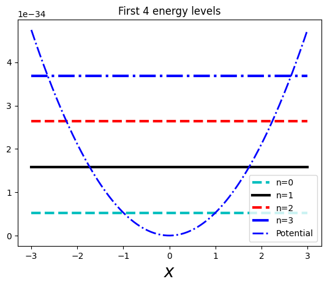
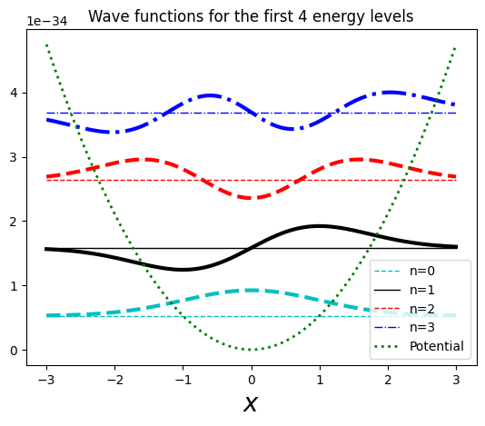
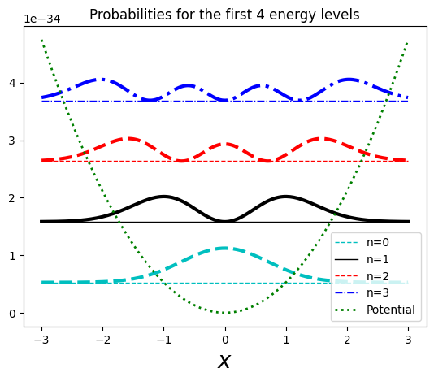

## Harmonic oscillatoa

This time let's give a look at the harmonic oscillator. This is a very useful
case, as most curved potentials can be aproximated at their local minimums as
harmonic oscillators.

In a classical frictionless harmonic oscillator, we had the force (**Hooke's
law**):

$$
F = -kx = m\frac{d^2x}{dt^2}
$$

The solution for this is (as we saw in the infinite well):

$$
x(t) = A\sin{\omega t} + B\cos{\omega t}
$$

with:

$$
\omega \equiv \sqrt{\frac{k}{m}}
$$

This gives a potential (around $x_0$ for small oscillations):

$$
V(x) = \frac{1}{2}m\omega^2x^2
$$

With this, we end up with the time-independent Schrödinger equation:

$$
-\frac{\hbar^2}{2m}\frac{d^2\psi}{dx^2} + \frac{1}{2}m\omega^2\psi = E\psi
$$

Now, this can be solved analytically (change of variable + power of series, ...)
or using a slick fancy method using the **raising** and **lowering** operators.

## Raising and lowering operators

Let's go fancy :)

First, we can define the operators:

$$
\hat{a}_\pm \equiv \frac{1}{\sqrt{2\hbar m \omega}}(\mp i\hat{p} + m\omega x)
$$

Now, these operators are such that if $\psi$ satisfies the Shrödinger equation
with energy $E$, then $\hat{a}_\pm\psi$ also satisfies it with energy
$E \pm \hbar\omega$.

Essentially:

$$\hat{H}(\hat{a_\pm} \psi) = (E \pm \hbar\omega)(\hat{a}_\pm \psi)$$

There has to be a lower boundary though, as $E\nless 0$, this is:
$$\hbar{a}_-\psi_0 = 0$$

This gives:

$$
\psi_0(x) = \left(\frac{m\omega}{\pi\hbar}\right)^\frac{1}{4}e^{-\frac{m\omega}{2\hbar}x^2}
$$

Giving an energy (when plugging it into the Shrödinger equation):

$$
E_0 = \frac{1}{2}\hbar\omega
$$

And now, given a lower boundary state (**ground state**), we can generate the
rest of the states by just applying the **raising** operator:

$$
\psi_1 = \hbar{a}_+\psi_0
$$

Giving the generic:

$$
\psi_n(x) = C_n(\hbar{a}_+)^n\psi_0(x), \hspace{0.5cm}\text{with}\hspace{0.5cm} E_n = \left(n+\frac{1}{2}\right)\hbar\omega\hspace{.5cm}\text{and }n = 1,2,3,...
$$

Where $C_n$ are normalization coefficients that after some extra work
normalizing some of the states, we end up with:

$$
A_n = \frac{1}{\sqrt{n!}}
$$

This can be rewritten using
[**Hermite polynomials**](https://en.wikipedia.org/wiki/Hermite_polynomials),
like:

$$
\psi_n(x) = \left(\frac{m\omega}{\pi\hbar}\right)^\frac{1}{4}
\frac{1}{\sqrt{2^nn!}}
H_n(\xi)e^{-\frac{\xi^2}{2}}
$$

Where we have $H_n$ being the Hermitian polynomial of order $n$ and:

$$
\xi = \sqrt{\frac{m\omega}{\hbar}}x
$$

So, putting it all together:

$$
\psi_n(x) = \left(\frac{m\omega}{\pi\hbar}\right)^\frac{1}{4}\frac{1}{\sqrt{2^nn!}}H_n(\xi)e^{-\frac{\xi^2}{2}} \hspace{1cm}\text{where }\xi = \sqrt{\frac{m\omega}{\hbar}}x
$$

$$
E_n = \left(n+\frac{1}{2}\right)\hbar\omega
$$

## Plots

Here are the plots of the energy levels, the wave functions and the
probabilities against the potential. Note that again, the particle can't be
found everywhere, and notice that at higher energy levels the outer sides of the
probability are higher (eventually looking similar to the classical
probability).

You can find the code for the graphs
[here](https://github.com/david-caro/musings/blob/main/content/posts/2023-12-21-Quantum-physics-harmonic-oscillator-1d/code/harmonic-oscillator-1d.ipynb).
