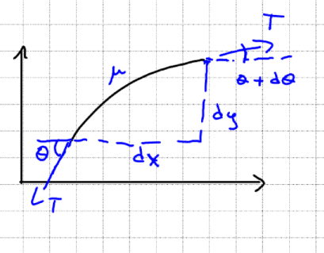

As part of my Uni courses, I want to write down the basic derivation of the
one-dimensional wave equation on a rope, just as an exercise for myself :)

Let's imagine that we have a vibrating rope, and we chunk out a small fragment
of it.

If we draw the diagram of forces we'll get:

Where $\mu = dm/dl \approxeq dm/dx$ is the density, and $T$ is the tension on
the rope.

Using Newton's second law, for $x$:

$$
\mu dx\frac{d^2x}{dt^2} = T\sin{\left(\theta + d\theta\right)} - T\sin{\theta}
$$

Now, for very small values of $d\theta\lt\lt\theta$, we can use Taylor's
approximation around $d\theta = 0$:

$$
\sin{\left(\theta + d\theta\right)}
\approxeq \sin{\theta} + \frac{d}{d\theta}\left[\sin{\left(\theta + d\theta\right)}\right]_{d\theta=0}d\theta + O(d\theta^2)
= \sin{\theta} + \cos{\theta}d\theta + O(d\theta^2)
$$

Substituting back, we get:

$$
\mu dx\frac{d^2x}{dt^2} = T\sin{\theta} + T\cos{\theta}d\theta - T\sin{\theta} = T\cos{\theta}d\theta
$$

Rearranging a bit:

$$
\frac{d^2x}{dt^2} = \frac{T}{\mu}\cos{\theta}\frac{d\theta}{dx}
$$

For small $\theta$ approximation, we have $\cos{\theta} \approxeq 1$:

$$
\frac{d^2x}{dt^2} = \frac{T}{\mu}\frac{d\theta}{dx}
$$

This is nice, but there's three variables here, let's try to get rid of
$\theta$. With a bit of trigonometry, we can see that:

$$
\tan{d\theta} = \frac{dy}{dx}
$$

And again, doing Taylor approximation around $d\theta=0$, we get:

$$
\tan{d\theta} = \frac{dy}{dx} \approxeq d\theta
$$

Deriving with respect $x$ both sides:

$$
\frac{d^2y}{dx^2} = \frac{d\theta}{dx}
$$

And plugging this back to the equation from before, we end up with:

$$
\frac{d^2x}{dt^2} = \frac{T}{\mu}\frac{d^2y}{dx} \equiv c^2\frac{d^2y}{dx}
$$

And this is our wave equation! \o/, where it's usually defined
$c \equiv \sqrt{\frac{T}{\mu}}$ as the propagation velocity.
